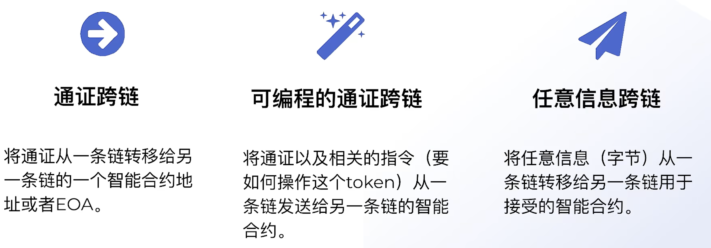
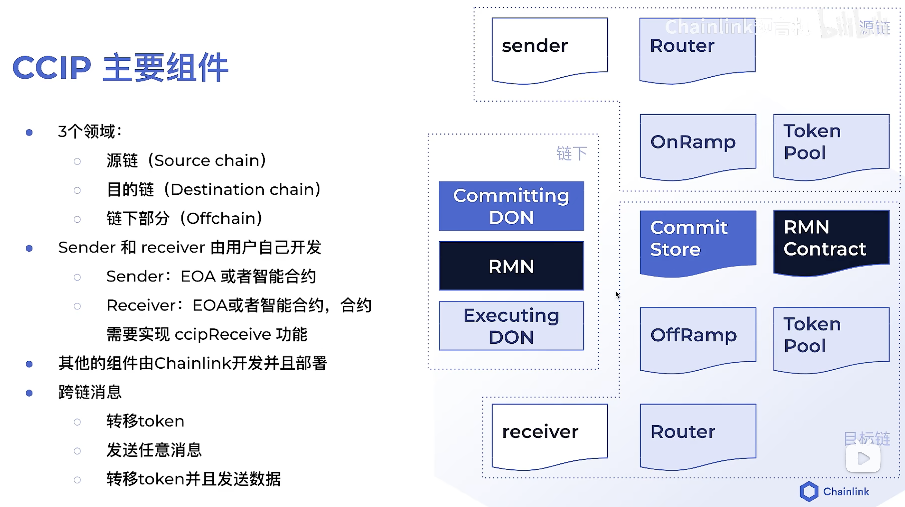
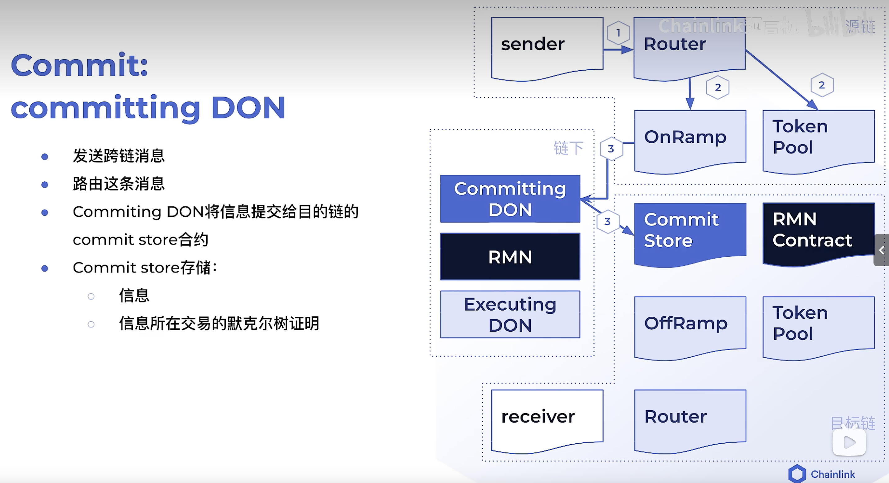
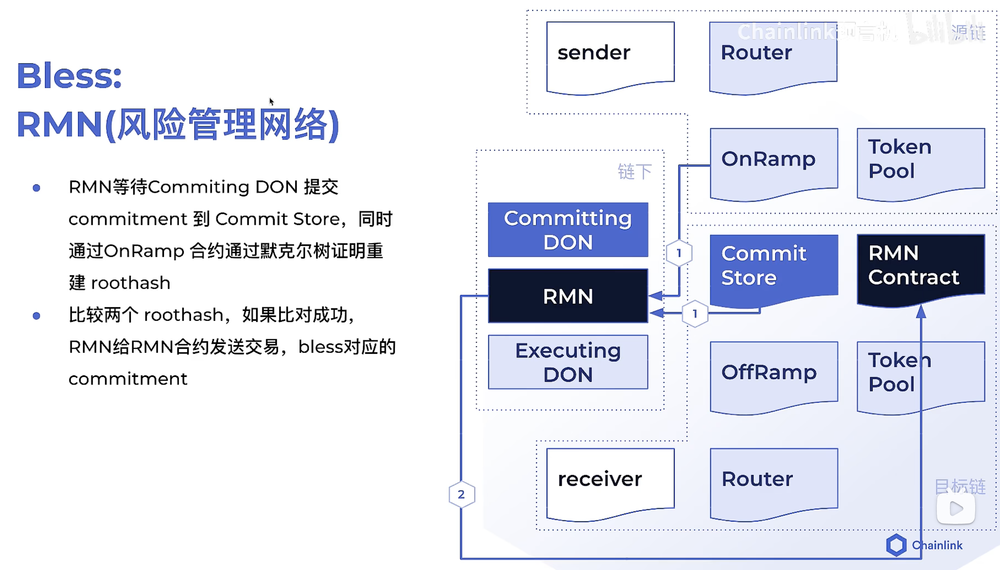
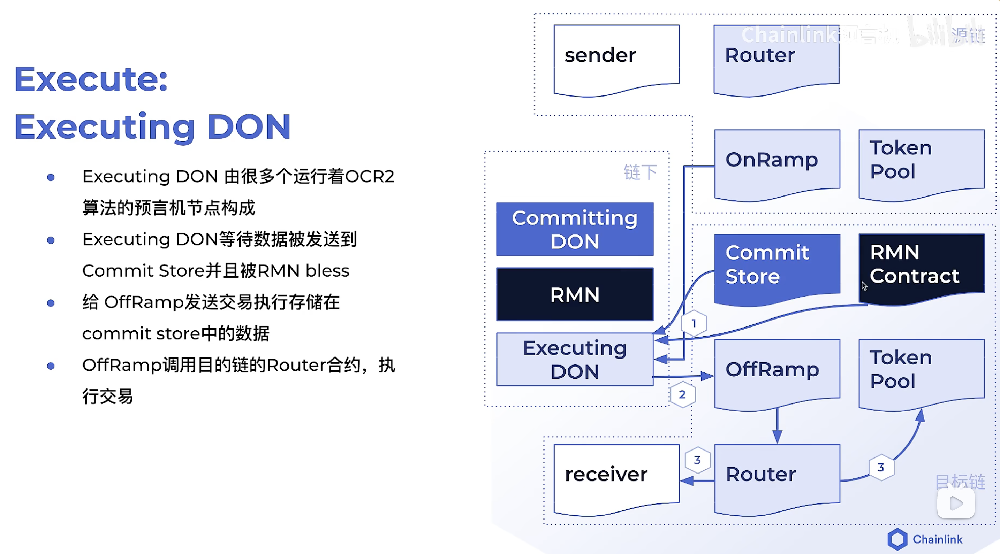
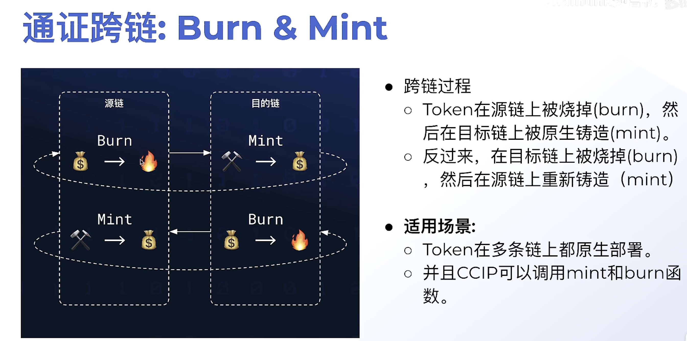
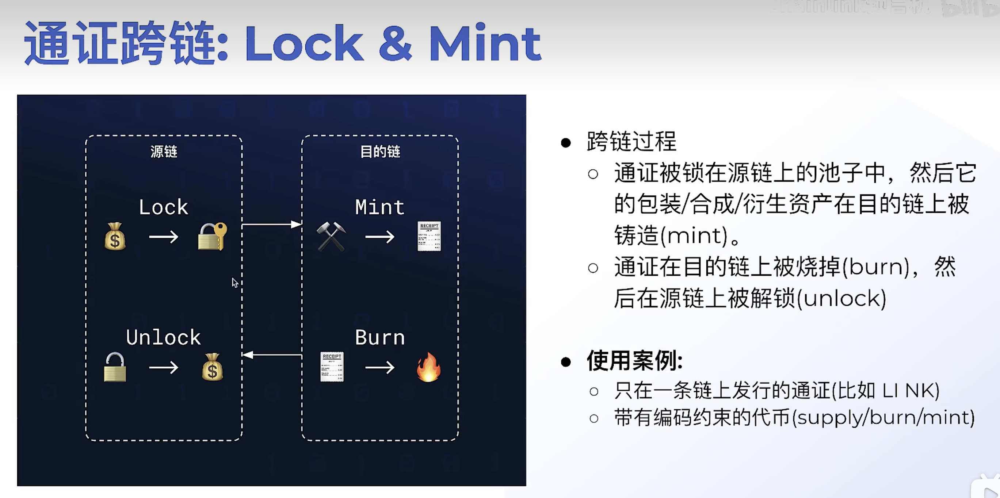
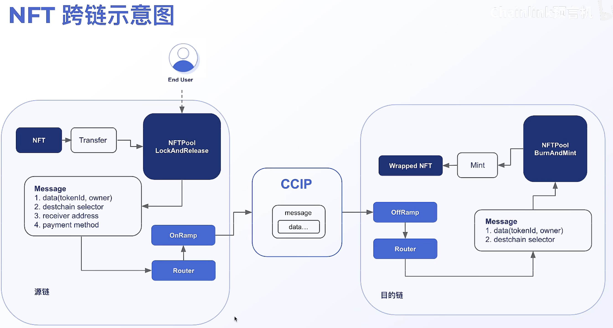

# Sample Hardhat Project

This project demonstrates a basic Hardhat use case. It comes with a sample contract, a test for that contract, and a Hardhat Ignition module that deploys that contract.

Try running some of the following tasks:

```shell
npx hardhat help
npx hardhat test
REPORT_GAS=true npx hardhat test
npx hardhat node
npx hardhat ignition deploy ./ignition/modules/Lock.js
```

通证跨链：
将通证从一条链转移给另一条链的一个智能合约地址或EOA
可编程的通证跨链：
将通证以及相关的指令（要如何操作这个token）从一条链发送给另一条链的智能合约
任意信息跨链：
将任意信息（字节）从一条链转移给另一条链用于接受的智能合约

跨链的发展阶段：



跨链的难点：

如何保障跨链信息的准确，谁有资格进行跨链，谁有资格进行验证，如何相信这个数据已经被验证了









通证跨链的方式








